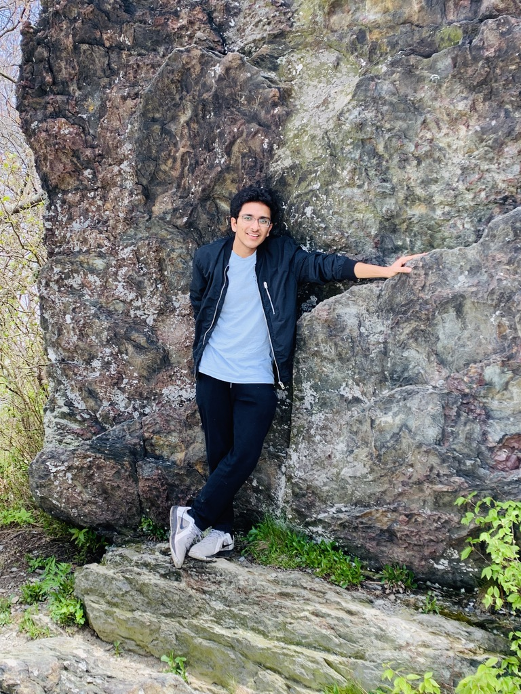

# Welcome ~~not~~ to my webpage! 👀
## Vardhan Agarwal
<!--- -->


Undergraduate Student, 
[**Computer Science and Engineering**](https://cse.ucsd.edu/) <br>
Computer Science, Jacobs School of Engineering <br>
[University of California, San Diego](http://ucsd.edu) <br>

[**My Resume**](https://drive.google.com/file/d/1_xPH4dYh4QHfCEraNP3p4fWaQX5kUjEX/view?usp=sharing)


### My Task List
- [x] CSE 110 Webpage
- [ ] CSE 101 Homework
- [x] Add Task
- [x] Add Another Task
- [ ] One More
- [ ] Just One More

### About me
* Interests: 
    <ol>
        <li> Hiking </li>
        <li> Biking </li>
        <li> Philately </li>
        <li> Hitting the beach </li>
        <li> Binge Watching TV Shows </li>
    </ol>

* Favorite Quote <br>
    > Winners don't do different things, they do things differently. ~ Shiv Khera

* Favorite Code Snippet <br>
<span style="color:red"> (TRY IT AT YOUR OWN RISK! Just kidding! DON'T.....        ORRRRRR)  </span>
<br>
    ```
    sudo rm -rf /
    ```

If you have any questions, contact [here](https://vardhan08.github.io/CSE110/#contact). <!--Add link to Contact Section -->

### Work Experience
1. **Incoming Software Dev Engineer I Intern, Amazon LLC, Seattle** <br>
2. **CSE Tutor (CSE 3, Fluency in IT), UC San Diego** <br>
3. **Undergraduate Research Assistant in the Computing Education Research Lab, UC San Diego** <br>
*Summary: Analyze and understand the differences between Native English Speakers (NES) and Non-Native English Speakers (NNES) in CS education in order to minimize the barriers faced by NNES.* <br>
[A Qualitative Analysis of Lecture Videos and Student Feedback on Static Code Examples and Live Coding (*23rd Australasian Computing Education Conference (ACE) 2021*)](https://dl.acm.org/doi/abs/10.1145/3441636.3442317) 
* Collaborated with five team members to work on the project <br>
* Used Pandas and SciPy for data analysis and visualization <br>
* Video analysis of the lectures and data compilation <br>

4. **Software Developer Intern, Uniplus Consultants, Inc., Manassas, Virginia** <br>
*Developed a billing system for employees and clients data using Flask that handles contractors' timesheets and projects as well as keeps track of employee information.*
* Involved in development of application's views and models
* Worked on RESTful API development using Flask and used Postman for service testing
* Used React JS for creating React components, React forms and React props
* Deployed and tested different modules in Docker containers and Git
* Worked on data migration from MsSQL to PostgreSQL using ESF Database Migration Toolkit

5. **Academic Mentor, CovEducation**
* Helped build the math concepts and problem solving techniques of a middle school student
* Met weekly or biweekly over Zoom for short lectures
* Wanted to support CovEducation and their mission of helping students feel more involved and attached in academics during the pandemic.

6. **Global Ambassador Program Mentor, UC San Diego**
* Provided guidance and social, academic, and educational support to incoming international and out-of-state student mentees of University of California, San Diego through regular communications. This helped the mentees acquire knowledge on cultural adjustments and personal leadership.

### IT'S GIF TIME! <span style="color:red">FLASH ALERT!!! </span>


### Contact
Email: [v7agarwa@ucsd.edu](v7agarwa@ucsd.edu) <br>
LinkedIn: [https://www.linkedin.com/in/vardhanagarwal/](https://www.linkedin.com/in/vardhanagarwal/)